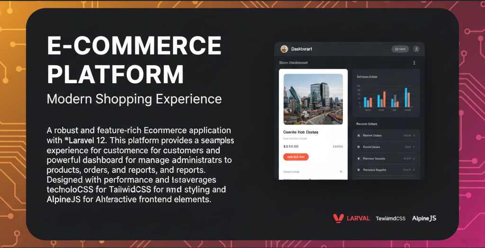

# 🛒 Laravel Ecommerce Platform



## 📖 About The Project

A robust and feature-rich Ecommerce application built with **Laravel 12**. This platform provides a seamless shopping experience for customers and a powerful dashboard for administrators to manage products, orders, and reports.

Designed with performance and scalability in mind, it leverages modern technologies like **TailwindCSS** for styling and **AlpineJS** for interactive frontend elements.

---

## ✨ Key Features

### 🛍️ Customer Experience

-   **Product Browsing:** Explore products by categories with detailed views.
-   **Shopping Cart:** Real-time cart management (Add, Update, Remove items).
-   **Secure Checkout:** Multiple payment options including:
    -   💳 **Stripe** Integration
    -   🅿️ **PayPal** Integration
    -   💵 **Cash on Delivery**
-   **User Accounts:** Registration, Login, and Profile Management.
-   **Order History:** Customers can view their past orders and status.

### 🛠️ Admin Dashboard

-   **Dashboard Overview:** At-a-glance statistics.
-   **Product Management:** Create, Read, Update, and Delete (CRUD) products.
-   **Category Management:** Organize products into categories.
-   **Order Management:** View order details and update order statuses.
-   **User Management:** Manage registered users and administrators.
-   **Reports & Analytics:**
    -   Revenue by Month/Year
    -   Revenue by Category

---

## 🚀 Tech Stack

-   **Backend:** [Laravel 12](https://laravel.com) (PHP 8.2+)
-   **Frontend:** [Blade Templates](https://laravel.com/docs/blade), [TailwindCSS 3](https://tailwindcss.com), [AlpineJS](https://alpinejs.dev)
-   **Build Tool:** [Vite](https://vitejs.dev)
-   **Database:** MySQL
-   **Payments:** Stripe SDK, PayPal

---

## 🛠️ Installation & Setup

Follow these steps to get the project running on your local machine.

### Prerequisites

-   PHP >= 8.2
-   Composer
-   Node.js & NPM
-   MySQL

### Steps

1.  **Clone the Repository**

    ```bash
    git clone https://github.com/yourusername/your-repo-name.git
    cd your-repo-name
    ```

2.  **Install PHP Dependencies**

    ```bash
    composer install
    ```

3.  **Install Frontend Dependencies**

    ```bash
    npm install
    ```

4.  **Environment Configuration**
    Copy the `.env.example` file to `.env` and configure your database and payment credentials.

    ```bash
    cp .env.example .env
    ```

    _Update `DB_DATABASE`, `DB_USERNAME`, `DB_PASSWORD` in `.env`._
    _Add your Stripe and PayPal keys in `.env`._

5.  **Generate Application Key**

    ```bash
    php artisan key:generate
    ```

6.  **Run Migrations**
    Set up the database tables.

    ```bash
    php artisan migrate
    ```

7.  **Build Assets**

    ```bash
    npm run build
    ```

8.  **Start the Server**

    ```bash
    php artisan serve
    ```

    Visit `http://127.0.0.1:8000` in your browser.

---

## 🔑 Default Accounts

_If you have seeded the database, you might want to list default credentials here (e.g., for admin)._

---

## 🤝 Contributing

Contributions are welcome! Please feel free to submit a Pull Request.

1.  Fork the Project
2.  Create your Feature Branch (`git checkout -b feature/AmazingFeature`)
3.  Commit your Changes (`git commit -m 'Add some AmazingFeature'`)
4.  Push to the Branch (`git push origin feature/AmazingFeature`)
5.  Open a Pull Request

---

## 📄 License

Distributed under the MIT License. See `LICENSE` for more information.
